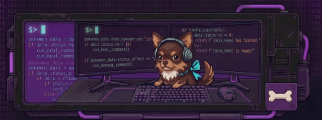

<div align="center">
  
</div>

<div align="center">
  <h1>🐾✨ AUdopt-me</h1>
  <p><i>An educational animal adoption platform developed with Angular, focusing on creating a responsive Single Page Application (SPA).</i></p>

  
  
  
  
</div>

<br>

---

## 📑 Table of Contents

- [Live Demo](#live-demo)
- [Preview](#preview)
- [Description](#description)
- [Technical Focus](#technical-focus)
- [Architecture](#architecture)
- [Getting Started](#getting-started)
- [Roadmap](#roadmap)
- [Author](#author)

---

## <a id="live-demo"></a>🌐 Live Demo

<div align="center">

[](https://thaisliira.github.io/AUdopt-me/)

*Click the button above to see the project in action.*
</div>

---

## <a id="description"></a>🎮 Description

**AUdopt-me** is a web application that simulates a real-world adoption portal. It was born from the belief that no animal should be left behind due to its breed or past. The project serves as a digital bridge between rescued animals and families looking for a new companion.

**Core Features:**
- **Animal Gallery:** Responsive grid with normalized images (aspect-square) and clean cards displaying adoption candidates.
- **Stories Blog:** Dynamic article listing using the `@for` directive.
- **Contact:** Interactive contact form interface.
- **Focused Mission:** Highlights mixed-breed pets and stories of resilience with a welcoming interface.

---

## <a id="technical-focus"></a>⚙️ Technical Focus

This project leverages the Angular ecosystem to manage navigation and dynamic content display, ensuring a fluid experience without page reloads.

**Key Concepts Applied:**
- **Single Page Application (SPA):** Ensuring smooth transitions and a modern user experience.
- **Angular Standalone Components:** A modern architecture that eliminates the need for heavy `NgModules`.
- **Angular Routing:** A routing system for seamless navigation between Home, Gallery, Blog, and Contact Us.
- **Dynamic Pipes:** Utilized to transform and format data directly in the templates.

---

## <a id="architecture"></a>🏗 Architecture

The codebase is organized following standard Angular conventions, making it easy to navigate and scale:

```text
src/
├── app/
│   ├── components/    # Reusable UI elements (e.g., Header, Footer)
│   ├── homepage/      # Specific components and logic for the landing page
│   ├── master-page/   # Main layout structure and structural wrappers
│   ├── models/        # TypeScript interfaces and data models
│   ├── pages/         # Core view components (Gallery, Blog, Contact)
│   ├── app.config.ts  # Angular application configuration
│   └── app.routes.ts  # Definition of all SPA navigation paths
├── index.html         # Main entry HTML file
├── main.ts            # Application bootstrap entry point
└── styles.scss        # Global stylesheet
```

---

## <a id="getting-started"></a>🚀 Getting Started

### Prerequisites
* **Node.js**
* **Angular CLI**
* A terminal or an IDE like VS Code.

### Installation & Execution

```bash
# 1. Clone the repository
git clone [https://github.com/thaisliira/AUdopt-me.git](https://github.com/thaisliira/AUdopt-me.git)
cd AUdopt-me

# 2. Install dependencies (recreates the node_modules folder)
npm install

# 3. Run the application
ng serve
```
*Navigate to `http://localhost:4200/` in your browser to see the application running.*

---

## <a id="roadmap"></a>🗺️ Roadmap

Future updates currently in development to expand the project:

- [ ] **Detailed Profiles:** Individual profile pages for each animal.
- [ ] **Advanced Filtering:** System to filter by animal type, size, and age.
- [ ] **Mock Backend:** Integration with a mock API/Backend for dynamic data fetching.

---

## <a id="author"></a>👩‍💻 Author

<table>
  <tr>
    <td align="center">
      <a href="https://github.com/thaisliira">
        <br>
        <sub><b>Thais Lira</b></sub>
      </a>
    </td>
  </tr>
</table>
